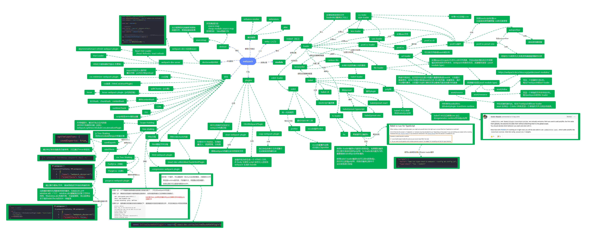

# webpack 前端工程化以及优化

## 区分生产环境与开发环境

## 分包

1. 入口分包 entry dependOn
2. [splitChunks](https://webpack.docschina.org/plugins/split-chunks-plugin/)

## 利用 import 动态引入

[魔法注释分包](https://webpack.docschina.org/api/module-methods#magic-comments)

```js
// 魔法注释（magic comments）
// 在.js文件中生效
import(
  /* webpackChunkName: format */
  /* webpackPrefetch: true */
  "./format.js"
).then(() => {});
```

## optimezation.runtimeChunk

runtimeChunk:各个模块之间的引用和加载的逻辑相关的代码默认内嵌入每个 entry 入口
如果抽离出来的 runtimeChunk 体积小可以可以内嵌附带在 html 中加载出来

## externals CDN

第三方库 cdn 抽离 unpkg, bootcdn

## 概览


